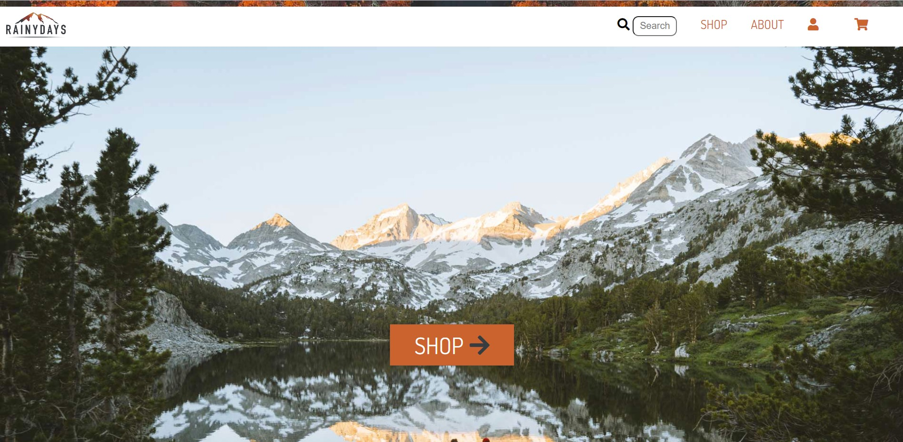

# CA Rainy Days

  
[Visit deployed site here](https://rainydaysmoamistay.netlify.app/ "Rainy Days")

[Figma prototype](https://www.figma.com/file/eqDWShsjKzSWIs7A8vGNL9/DESKTOP?node-id=0%3A1&t=UKhrRRRwr147PcKA-1 "Figma Prototype")
[Figma style tile and moodboard](https://www.figma.com/file/RA4WAb3cYJ4NIcqBWgCkks/Rainy-Days-ORG?node-id=0%3A1&t=AfxfziaKHL00pBwQ-1 "Style tile and moodboard")

---

# Process and result

This was the first big project we received and we were tasked with building an entire website. Although we only used vanilla HTML and CSS. We did not use any javascript so there was no real functionality to the site.

The design process was fun and I wanted to create a site that had more cozy, "earthy" and intimate feel rather than a typical modern look.

The design is not perfect by any means, but based off of what I was aming for I think it turned out alright.

The HTML and (especially) the CSS code was quite messy and unorganized at this point. But I learned a few things in that regard that I used in future projects. Particularly in regard of use of classes.

---

# Assignment

Create a website for an online clothing shop called "Rainy Days" that mainly sells rain coats.

Only use HTML and CSS and focus on creating a suiting design that fits for a user group of both men and women in age range 26-50 years old.

---

# Sources

Logo was given to us as part of the project. However the one I used on the finished site was slightly altered in photoshop.  
[Rainy Days logo](https://www.cleanpng.com/png-mountain-range-silhouette-4680967/ "Rainy Days logo")

The rest of the images was taken from unsplash

Png's for the clothes:

[Header autumn image](https://unsplash.com/s/photos/autumn "header")
License: Unsplash lisence; commercial and non-commercial

[Rainjacket black png](http://pngimg.com/image/88371 "rainjacket")
License: Creative Commons

[Rainjacket red png](http://pngimg.com/image/88369 "rainjacket")
License: Creative Commons

[CAT shoes](http://pngimg.com/image/7781 "shoes")
License: Creative Commons

[Shoes black](http://pngimg.com/image/7780 "shoes")
License: Creative Commons

[hat](https://www.kindpng.com/free/beanie/ "hat")
License: Personal use only

[Umbrella black](http://pngimg.com/image/489 "umbrella")
License: Creative Commons

[Umbrella red](http://pngimg.com/image/69117 "umbrella")
Lisence: Creative Commons

[Beanie 1 and 2](https://www.pngfind.com/download/xbiRio_black-beanie-png-transparent-png/ "beanie")
Lisence: Personal Use only
